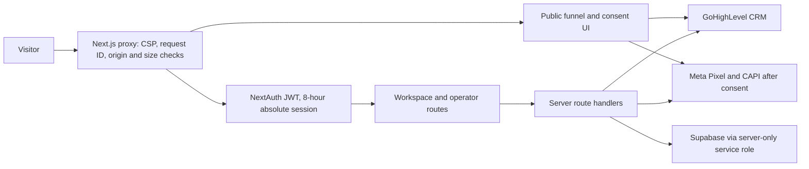

# Architecture

## System boundary

UnReal BS is one Next.js 16 application deployed to Vercel. `proxy.ts` is the request boundary: it adds request IDs and a nonce-based CSP, blocks unsafe cross-origin/non-JSON API mutations, keeps commerce routes dark, and redirects protected routes to login.



## Security model

- Public inputs are schema-bounded. Unsafe JSON APIs enforce same origin, content type, body size, request ID, and fail-closed throttles on high-value operations.
- `lib/security/admin.ts` owns administrator authorization. A matching UI state never substitutes for server authorization.
- Sensitive card and money actions require the normal session plus a signed HttpOnly `SameSite=Strict` step-up cookie that expires after ten minutes.
- Structured audit records are append-only. Logs pass through recursive PII/credential redaction.
- CSP is report-only until the preview integration matrix is clean; `CSP_ENFORCE=true` switches to enforcement.

## Commerce model

`COMMERCE_ENABLED`, `STORE_PUBLIC_ENABLED`, `MARKETPLACE_SELLERS_ENABLED`, and `COMMERCE_CANARY_EMAILS` are server-controlled. Products are assigned to a server-created platform-owner record regardless of client input. Marketplace and payout APIs are unavailable when their flag is off.

Orders follow:

```text
pending_payment -> verification_submitted -> paid -> refunded
        |                    |
        +--------------------+-> rejected
```

Free orders move directly from `pending_payment` to `paid`. Paid access is impossible before the operator-confirmation function commits. Confirmation/refund functions check expected state and idempotency keys inside Postgres. Access uses a one-time opaque bearer whose SHA-256 hash is stored.

## Meta attribution

The browser persists a versioned consent choice and bounded first-party attribution. Pixel loads only after consent. Browser/server events reuse the same event ID. `Lead` follows successful GHL application creation; `InitiateCheckout` follows order creation; `Purchase` follows the database payment-confirmation operation. CAPI hashes normalized identifiers, uses short timeouts, and retries with the same event ID.

## Data and integrations

- Supabase is accessed only by server routes using the service-role client. Migration `0015_pre_ad_launch_hardening.sql` removes API-role access from commerce tables/RPCs and adds audit/idempotency controls.
- Product files live in private Supabase Storage and are released with short-lived signed URLs using download disposition.
- GoHighLevel remains the application/CRM destination and paid-buyer sync target. Provider failures are logged but do not reverse a committed order.
- Puter/Monaco/video sources are included in the CSP allowlist and must be preview-tested before CSP enforcement.
